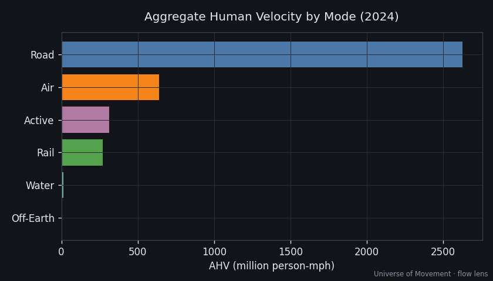

# Universe of Movement

> Measuring how fast the human race is moving — the aggregate speed of every
> human on Earth, mode by mode, tracked over time. A sister project to the
> [Universe of Finance](../universe-of-finance).

## The Big Number

### **AHV ≈ 3.86 billion person-mph**

Aggregate Human Velocity — the rate at which humanity as a whole covers distance,
summed over every moving human: **Σ (people × speed)**.

| Metric | Value | Meaning |
|--------|-------|---------|
| **AHV** | **3.86 billion person-mph** | The Big Number |
| **v̄** | **0.48 mph** | The average human's time-averaged speed |
| **Odometer** | **33.8 trillion person-miles/yr** | ~182,000 round-trips to the Sun / year |
| People in motion | **~2.3% of humanity** | at any average instant |



## Three counter-intuitive findings

1. **The average human moves at ~0.5 mph.** Time-averaged, v̄ is under 1 mph —
   the **median** human right now is doing **0 mph** (sitting still).
2. **Road wins the snapshot; air wins per-traveller.** Road = 68% of AHV on
   headcount (~88M people moving). Aviation = 16.5% from ~1.3M people airborne
   (0.016% of humanity).
3. **Ubiquity beats speed.** Active travel (~3.4 mph) out-contributes rail,
   because ~92M people are always on foot or bike.

## Modal Leaderboard

| # | Mode | AHV (M person-mph) | Share | Confidence |
|---|------|--------------------|-------|------------|
| 1 | Road | 2,625 | 68.0% | 🟡 |
| 2 | Air | 638 | 16.5% | 🟢 |
| 3 | Active | 312 | 8.1% | 🔴 |
| 4 | Rail | 270 | 7.0% | 🟡 |
| 5 | Water | 14 | 0.4% | 🔴 |
| 6 | Off-Earth | 0.17 | 0.004% | 🟡 |

**Interactive dashboard:** [quackstra.github.io/universe-of-movement](https://quackstra.github.io/universe-of-movement/) ·
Full write-up: [**The Big Number**](analysis/aggregate/BIG_NUMBER.md) ·
[**Research Index**](analysis/README.md).

**Deep Dive:** [North American Consumer Auto](analysis/deep-dives/north-american-consumer-auto/REPORT.md)
— the public's ~2.85T vehicle-miles of personal driving, split by vehicle type;
AHV ~515M person-mph (≈ all of global aviation).

## The Metric

- **AHV** (the Big Number) = Σ(people × speed), in **person-mph** — the rate.
- **v̄** = AHV ÷ population, in **mph** — the intuitive per-capita companion.
- **Odometer** = ∫AHV dt = total passenger-distance, in **person-miles** — ties
  directly to the world's best transport statistic, passenger-kilometres (pkm).

Two lenses that must reconcile: **flow** (annual pkm ÷ hours/yr — Run 1) and
**snapshot** (occupancy × speed at an instant). See [BRIEF.md](BRIEF.md).

## Scope (Run 1)

Passengers + crew + operators (cargo excluded — that's the "Movement of Stuff"
sidebar). Ground reference frame (cosmic motion is an appendix). Ambient movement
(pacing a room) deferred to a future methodology.

## Project Structure

```
universe-of-movement/
├── BRIEF.md                 # Mission, metric definitions, principles
├── TAXONOMY.md              # Full transport-mode taxonomy
├── analysis/
│   ├── README.md            # Research index + leaderboard
│   ├── aggregate/BIG_NUMBER.md  # The Big Number write-up
│   └── <mode>/<mode>/       # Per-mode capsules (REPORT + data.json + workings + charts)
├── scout/                   # Data-source discovery + backlog ranking
├── architect/               # Research methodology design (SKILL.md)
├── elves/                   # Autonomous research protocol + validation gates
├── tools/                   # ahv.py (Big Number), charts.py
└── notes/                   # Inter-session continuity
```

## Pipeline

`Scout → Architect → Elves → Publish`. Run the tooling:

```bash
./run.sh scout          # rank modes into scout/backlog.yaml
python3 tools/ahv.py    # recompute the Big Number
python3 tools/charts.py # regenerate charts
./run.sh elf-run        # full autonomous research run (48+ capsules)
```

## Status

**Run 2 complete (2026-07-20):** added the North American Consumer Auto deep dive,
an Off-Earth capsule (the fastest humans alive), and an interactive GitHub Pages
dashboard. **Run 1** forked the framework from Universe of Finance and established
the flow lens for the top 5 modes. Next: upgrade road's confidence with the deep
dive's methodology, add historic reconstruction (pre-rail → jet age), build the
snapshot lens, and expand toward the 48-capsule floor. See
[`notes/research_agenda.md`](notes/research_agenda.md).

## License

Research outputs: CC BY 4.0. Code: MIT.
