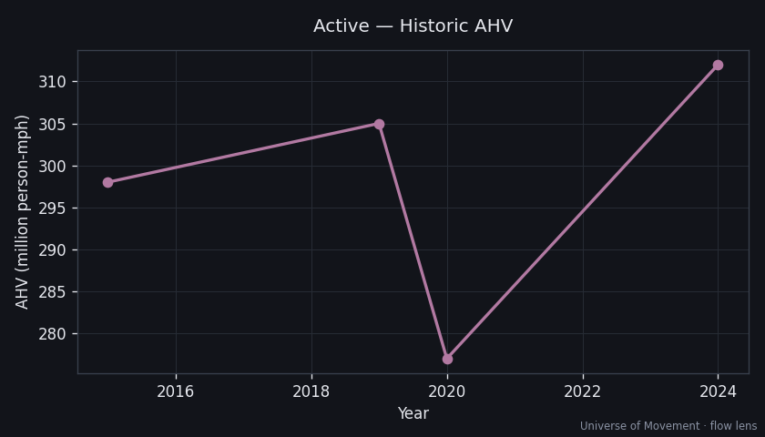

# Active Travel — Aggregate Human Velocity Analysis (Flow Lens)

> Part of the [Universe of Movement](../../../README.md) project. Run 1, flow lens.

## Executive Summary

Purposeful walking, cycling and running produce an estimated ~**4.4 trillion
pkm/yr** — an **AHV of ~312 million person-mph**, *larger than rail (270M)* and
comparable in headcount to road: ~**92 million people are actively travelling
under their own power at any average instant** (~1.1% of humanity). The paradox:
active travel is slow (~3.4 mph) yet nearly ubiquitous, so ubiquity beats speed.

## Scope & the ambient boundary (important)

**Included:** trip-based active travel — walking to work/transit/errands,
cycling, running as transport or exercise (the human is the *operator*).

**Excluded (for now):** *ambient* movement — pacing a room, walking around a
house, moving on a factory floor. Per Run 1's scope decision, ambient is deferred
to a future methodology. **This is the single biggest uncertainty in the whole
project**: if ambient movement (~1–2 km/person/day more) were counted, active AHV
could roughly double and materially raise v̄. Flagged loudly, not silently
assumed.

## Current State

| Metric | Value | Source | Confidence |
|--------|-------|--------|------------|
| Annual pkm (2024) | ~4.4 trillion | Population-scaled trip estimate | 🔴 |
| Average speed | ~3.4 mph (blend) | Walking 3 / cycling 10 | 🔴 |
| **AHV** | **312M person-mph** | 4.4e12 × 0.621371 / 8760 | 🔴 |
| People in motion (avg) | ~92M | AHV ÷ 3.4 | 🔴 |
| Population share | ~1.1% | — | 🔴 |

## Historic Trend

Active-travel pkm scales roughly with population (~4.2T in 2015 → 4.4T in 2024),
with a modest 2020 dip as lockdowns cut trip-based walking.

## Subcategory Breakdown

| Subcategory | Share of active pkm | Avg speed |
|-------------|---------------------|-----------|
| Walking (purposeful trips) | 78% | 3.0 mph |
| Cycling | 20% | 10 mph |
| Running / jogging | 2% | 6 mph |

## Projections (AHV, person-mph)

| Scenario | 2030 | 2050 | Key assumptions |
|----------|------|------|-----------------|
| Baseline (+1%/yr) | 331M | 404M | Tracks population + modest active-travel policy |
| High-Mobility (+2%/yr) | 352M | 464M | E-bike/cycling infrastructure boom |
| **Substitution (+3%/yr)** | 372M | 673M | **15-minute cities shift trips from car to foot/bike** |

> Note the inversion vs. every other mode: the **substitution** scenario is
> active travel's *highest* — the same forces that shrink road *grow* walking.

## Key Findings

1. **Ubiquity beats speed**: active travel out-contributes rail on AHV despite
   averaging ~3.4 mph, because ~1.1% of humanity is always on foot/bike.
2. **The ambient boundary dominates uncertainty** — the honest headline caveat.
3. **Active travel is the substitution winner** — decoupling physical progress
   from *vehicles* still means humans move, just slowly and under their own power.

## Data Quality & Limitations
- Whole capsule is 🔴: derived from per-capita trip-distance assumptions, not
  direct measurement. National travel/time-use surveys (NHTS, ATUS, UK NTS) are
  the Run-2 upgrade path.

## Sources
1. [WHO — Physical activity](https://www.who.int/news-room/fact-sheets/detail/physical-activity)
