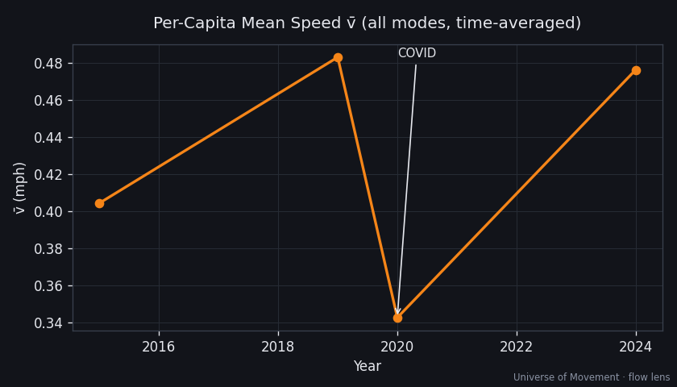

# The Big Number — Aggregate Human Velocity (Run 1, Flow Lens)

> How fast is the human race moving, in aggregate, right now?

## The headline

### **AHV ≈ 3.86 billion person-mph**

That is the rate at which humanity as a whole covers distance — the sum, over
every moving human, of (people × speed). It is built from the **flow lens**:
annual passenger-kilometres by mode ÷ hours per year.

| Metric | Value | Meaning |
|--------|-------|---------|
| **AHV** | **3.86 billion person-mph** | Aggregate Human Velocity (the Big Number) |
| **v̄** | **0.48 mph** | The average human's time-averaged speed |
| **Odometer** | **33.8 trillion person-miles/yr** | Humanity's annual distance |
| — equivalent | **~182,000 round-trips to the Sun / yr** | odometer ÷ 186M mi |
| People in motion (avg) | **~190M (~2.3%)** | at any average instant (mech. ~1.2%) |


## The modal leaderboard

| # | Mode | AHV (M person-mph) | Share | Confidence |
|---|------|--------------------|-------|------------|
| 1 | Road | 2,625 | 68.0% | 🟡 |
| 2 | Air | 638 | 16.5% | 🟢 |
| 3 | Active (walk/cycle) | 312 | 8.1% | 🔴 |
| 4 | Rail | 270 | 7.0% | 🟡 |
| 5 | Water | 14 | 0.4% | 🔴 |
| | **Total** | **3,859** | **100%** | |

> The top mode (road) is ~68% of the total; road + air + rail ≈ 91%. Establishing
> those three well gets us most of the Big Number — the inside-out payoff.

## The three counter-intuitive findings

1. **The average human moves at ~0.5 mph.** Time-averaged over the whole year and
   the whole population, v̄ is under 1 mph — because at any instant ~98% of humans
   are not in a vehicle. The **median** human speed right now is **0 mph**.
2. **Road wins the snapshot; air wins per-traveller.** Road is 68% of AHV on sheer
   headcount (~88M people moving). Aviation produces 16.5% from just ~1.3M people
   airborne — 0.016% of humanity generating one-sixth of the world's motion.
3. **Ubiquity beats speed.** Active travel (~3.4 mph) out-contributes rail because
   ~92M people are always walking or cycling. Slow-but-everywhere > fast-but-rare.

## v̄ over time — and the COVID signature



The 2020 dip is humanity's **great deceleration**: aviation fell 66%, rail 44%,
road ~20%. It is the cleanest datable inflection in the modern movement record —
the first time in a century the human race measurably slowed down.

## How AHV was computed

```
AHV [person-mph]   = Σ_mode ( annual_pkm × 0.621371 / 8760 )
v̄  [mph]          = AHV / 8.1e9
Odometer [p-mi/yr] = Σ_mode annual_pkm × 0.621371
```

Recompute anytime: `python3 tools/ahv.py`. Per-mode inputs, sources, and
derivations are in each capsule's `data.json` and `workings/`.

## Confidence & the honest caveats

- **Road (68%) is 🟡** — sourced as the ITF residual, not a direct measurement.
  Upgrading it is Run 2's highest-value task.
- **Active (8%) is 🔴** and excludes *ambient* movement by design. Counting ambient
  could roughly double active AHV and lift v̄ noticeably — the biggest known
  unknown.
- This is the **flow lens** only. A **snapshot-lens** reconciliation (occupancy ×
  time-use) is the planned independent cross-check.

## What this is not (yet)

Run 1 covers 5 mechanised/active modes at the present day. Not yet included:
micromobility, vertical/conveyed motion, off-Earth (astronauts — the fastest
humans alive at ~17,500 mph), deep historic reconstruction (pre-rail → jet age),
and the snapshot lens. See [`../../notes/research_agenda.md`](../../notes/research_agenda.md).
