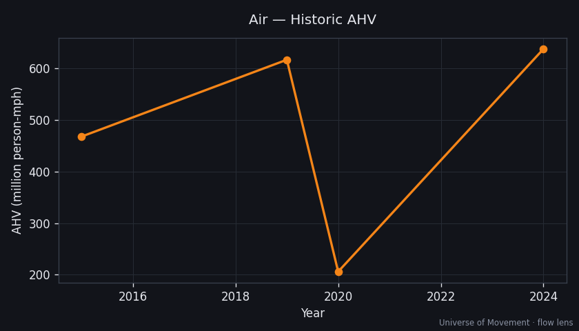

# Air — Aggregate Human Velocity Analysis (Flow Lens)

> Part of the [Universe of Movement](../../../README.md) project. Run 1, flow lens.

## Executive Summary

Commercial aviation carried ~**9.0 trillion revenue passenger-km** in 2024
([IATA, Jan 2025](https://www.iata.org/en/pressroom/2025-releases/2025-01-30-01/)),
a record and 3.8% above pre-pandemic 2019. That converts to an **AHV of ~638
million person-mph** — the second-largest modal contribution — carried by only
~**1.3 million people airborne at any instant** (0.016% of humanity). Aviation is
the extreme case of the flow-vs-snapshot split: tiny headcount, enormous distance.

## Scope

Humans aboard passenger and military aircraft (passengers + crew). Freight
tonne-km excluded. Reference frame: ground. Metric: AHV = annual pkm ÷ hours/yr.

## Current State

| Metric | Value | Source | Confidence |
|--------|-------|--------|------------|
| Annual pkm (2024) | 9.0 trillion | [IATA 2024 RPK](https://www.iata.org/en/pressroom/2025-releases/2025-01-30-01/) | 🟢 |
| Average speed | ~480 mph (block) | Derived (cruise ~560) | 🟡 |
| **AHV** | **638M person-mph** | 9.0e12 × 0.621371 / 8760 | 🟢 |
| People in motion (avg) | ~1.33M | AHV ÷ 480 | 🟡 |
| Population share | 0.016% | — | 🟡 |

Cross-check: independent estimates put ~0.5–1.2M people airborne at any moment
([sources](https://www.allinallspace.com/how-many-airplanes-and-people-are-in-the-sky-at-any-given-second/)),
bracketing our 1.33M derivation — the flow and snapshot lenses reconcile.

## Historic Trend

Air pkm rose from ~6.6T (2015) to 8.7T (2019), **collapsed to 2.9T in 2020**
(−66%, the sharpest deceleration of any mode during COVID), and fully recovered
to 9.0T by 2024.

## Subcategory Breakdown

| Subcategory | Share | Avg speed |
|-------------|-------|-----------|
| Commercial long-haul | 55% | 520 mph |
| Commercial short-haul | 40% | 430 mph |
| General & business aviation | 4% | 350 mph |
| Military (crew) | 1% | 450 mph |

## Projections (AHV, person-mph)

| Scenario | 2030 | 2050 | Key assumptions |
|----------|------|------|-----------------|
| Baseline (+3.5%/yr) | 784M | 1.57B | Demand tracks GDP; fleet efficiency neutral to AHV |
| High-Mobility (+5%/yr) | 856M | 2.27B | Asia-Pacific + Africa liberalisation; supersonic revival post-2035 |
| Substitution (+1%/yr) | 677M | 827M | Telepresence + carbon pricing suppress business travel |

## Key Findings

1. **Aviation is the flow-lens heavyweight per traveller**: 0.016% of humanity
   produces 17% of mechanised AHV.
2. **The COVID signature is unmistakable**: no other mode fell 66% in a year.
3. **The scenario fan is wide by 2050** (0.83B–2.27B) — aviation is where the
   "is humanity still speeding up?" question is most contested.

## Data Quality & Limitations

- RPK counts revenue passengers; GA/military crew estimated (🔴 for the 5%).
- Block-speed average is a modelled blend, not measured.

## Sources
1. [IATA — Record High Demand 2024](https://www.iata.org/en/pressroom/2025-releases/2025-01-30-01/)
2. [IATA — RPKs and ASKs explained](https://www.iata.org/en/publications/newsletters/iata-knowledge-hub/demystifying-key-air-traffic-metrics-understanding-rpks-and-asks/)
