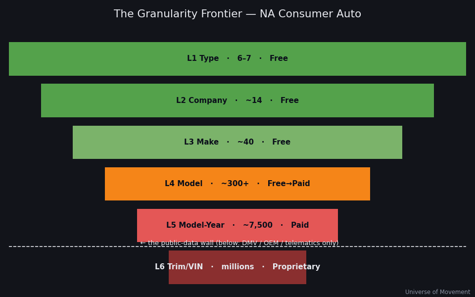

# The Granularity Frontier — How Deep Can We Go?

> A meta-deliverable. We pushed the North American consumer-auto deep dive down
> as far as public data allows — **type → company → make → model → model-year →
> (trim/VIN)** — to map where an autonomous research agent's reach ends and to
> unveil the new capabilities and data needs the wider *Universe of Research*
> will require. The number was not the point; **the frontier was.**

## The six levels of granularity

| L | Level | Distinct items (US) | Best public source | What we can measure | Confidence | Cost tier |
|---|-------|--------------------:|--------------------|---------------------|-----------|-----------|
| **L1** | Vehicle type | 6–7 | FHWA VM-1 + our split | VMT, occupancy, AHV | 🟡–🟢 | Free |
| **L2** | Company / OEM | ~14 | GoodCarBadCar, OEM filings, Wolf St. | Sales share; VIO share (approx) | 🟡 | Free |
| **L3** | Make / brand | ~40 | Brand sales rankings | Sales; VMT via VIO-share allocation | 🟡 | Free |
| **L4** | Model | ~300 mainstream (1,000+ total) | Sales (free); **VIO by model (paid)** | VMT = VIO × mileage-curve | 🟡→🔴 | Free→**Paid** |
| **L5** | Model-year cohort | ~300 × ~25 = ~7,500 | Historical sales (free); **VIO×MY×region (paid)** | VMT via age-mileage + survival curve | 🔴 | **Paid** |
| **L6** | Trim / powertrain / VIN | millions | **DMV / OEM / telematics only** | — (not publicly researchable) | ⛔ | **Proprietary** |



**The wall is between L5 and L6.** Everything down to model-year can be *modelled*
from public statistics plus one bought dataset. Below that — actual miles by trim,
by VIN, by driver — only DMV registries, OEM connected-car telemetry, or insurer
telematics can see it. No amount of web research crosses that line.

## The method that got us to L5 (a new, reusable capability)

Model-level VMT is published **nowhere**. So we built it bottom-up:

```
personal_VMT(model) = VIO(model) × personal_share(model) × annual_miles(model)
```

- **VIO(model)** — grounded in S&P Global Mobility DMV shares (F-150 = 3.7% of all
  US vehicles, Silverado 2.7%, Camry 2.3%, Accord 2.0%, CR-V 2.0%) × 286M VIO.
- **annual_miles(model)** — from the NHTS **age–mileage decay curve** (1–5 yr
  >12,000 mi; 9+ yr ~7,800 mi; fleet avg ~10,200 mi), combined with a **survival
  curve** for the model-year drill.
- **personal_share(model)** — the fraction of that model in private hands (not
  fleet/commercial). This is the crux — see below.

This VIO × mileage-curve engine is **reusable for any region and any vehicle mode**
and is the main durable capability this run produced (`tools/granular_rollup.py`).

## What the descent unveiled (findings)

1. **The long tail is most of the distance.** Our 20 named models cover only
   **27.3%** of US personal VMT. The other ~73% is spread across 300+ models —
   granularity has steeply diminishing returns for the *aggregate*, but is
   essential for any *per-model* question.
2. **Occupancy reshuffles the model ranking.** By AHV, **CR-V and RAV4 outrank the
   Camry and Silverado** — SUVs' 1.7 occupancy beats sedans' 1.4 and pickups' work
   patterns. The "biggest by sales" ≠ "biggest by human-velocity."
3. **The personal/commercial split becomes decisive at model level.** The Ford
   F-150's *fleet* AHV is ~20.2M person-mph, but its *consumer* AHV is only
   ~11.5M — a **43% haircut** because so many F-150s are work trucks. At the
   aggregate we used one blended ~10% commercial factor; at model level that
   assumption breaks and every model needs its own split.
4. **One model can be ~2% of a continent's personal velocity.** The F-150 alone
   ≈ 2.2% of the entire North American consumer-auto AHV.
5. **Brand ≠ volume for human-velocity.** Toyota + Honda lead our tree's consumer
   AHV despite GM + Ford leading total US *sales* — because Toyota/Honda skew
   personal-use passenger vehicles, GM/Ford skew commercial trucks. (Caveat: the
   tree is a partial slice; GM/Ford have many models not yet entered.)

## New research NEEDS this exposes (the shopping list)

- **A paid VIO dataset** (S&P Global Mobility / Experian Velocity / Polk) to turn
  L4–L5 from 🔴 estimates into 🟢 measurements — a *data-procurement* need, not a
  research-skill need. First time this project has hit a hard paywall.
- **Telematics / connected-car VMT** (OEM APIs, insurer datasets) — the *only*
  path to true per-model, per-trim miles. A partnership/API need.
- **Per-model personal-vs-commercial splits** — DMV registration class + fleet
  registries. The single biggest error source below L3.
- **Survival / scrappage curves by model** — to distribute VIO across model-years
  correctly (we used generic curves; model-specific durability varies widely).
- **Regional model data for Canada & Mexico** — model-level VIO there is far
  thinner than the US; our granular tree is US-only (US = 90% of the NA deep dive).
  Cross-border model decomposition is an open gap.

## New research CAPABILITIES this run built

- **Bottom-up VIO × mileage-age-curve modelling** — reusable engine, any region/mode.
- **Hierarchical rollup + reconciliation** (`granular_rollup.py`): sum-of-parts
  vs. top-down total, with explicit coverage % — a new validation pattern for the
  whole Universe of Research (does the tree reconcile to the trunk?).
- **Confidence gradients within a single tree** — 🟢 at grounded top models, 🔴 at
  estimated tail — modelling honesty at scale.
- **Custom-mileage triangulation** (Run 4, `tools/mileage_model.py`) — a
  multiplicative, mean-normalized factor model (WHERE × HOW × WHO × NEW/USED × AGE)
  that turns marginal demographic/geographic data into per-unit mileage estimates,
  with explicit ecological-inference and collinearity handling. See
  [The Precision Layer](granular/PRECISION_MODEL.md). This is the method that lets
  us *estimate* below the public-data ceiling instead of stopping at it.

## Implication for the Universe of Research

This exercise is a template for *any* domain we census: there is always a
**public-data ceiling** (here, L5) and a **proprietary floor** (L6). Mapping that
boundary — and pricing the datasets that would lower the ceiling — is itself a
first-class research output. The lesson mirrors Universe of Finance's "Hypothesis
Generator": the most valuable thing an agent can do at the frontier is **state
precisely what it cannot know, and what it would take to know it.**

## Confidence & honesty

Top-5 model VIO is 🟢 (S&P DMV shares). Everything below — tail models, model-year
splits, personal shares, Canada/Mexico — is 🟡→🔴 modelled estimate. The tree's
27.3% coverage of US personal VMT is a *floor*; it is a demonstration of method
and frontier, **not** a precise model-by-model census (which requires the paid
datasets listed above).
