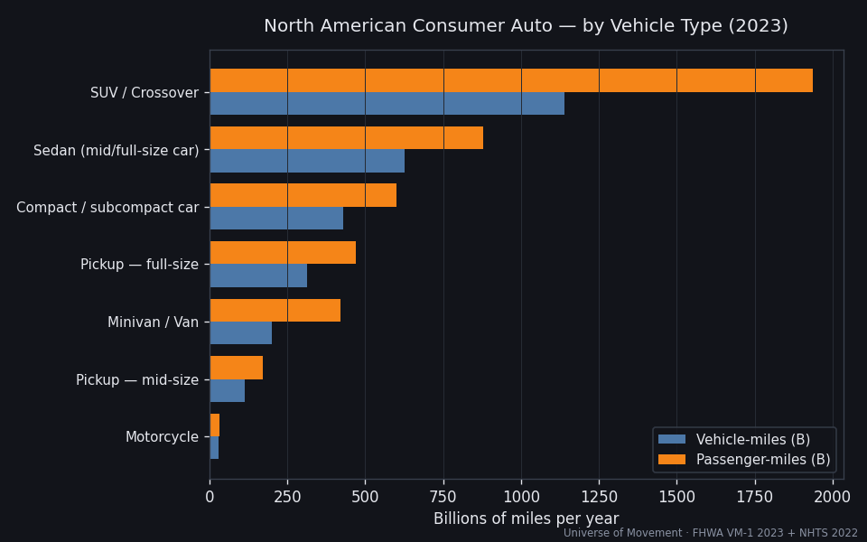

# Deep Dive — North American Consumer Auto

> Part of the [Universe of Movement](../../../README.md) project. Run 2, deep dive.
> **A subset of the global [Road](../../road/road/REPORT.md) mode — excluded from
> the global Big Number to avoid double-counting.**

## The question

**How many miles does the North American public drive for non-commercial,
non-government use — and how does that split by vehicle type?**

## Headline

North Americans personally drive ~**2.85 trillion vehicle-miles a year**, which
— at a blended occupancy of ~1.58 — is ~**4.51 trillion passenger-miles**, an
**AHV of ~515 million person-mph**.

> **That one slice of North American life — private cars and motorcycles — nearly
> equals the Aggregate Human Velocity of all commercial aviation on Earth (638M).**
> And it means that *from personal driving alone*, the average North American moves
> at ~**1.02 mph** — more than double the global all-mode average of 0.48 mph.

| Metric | Value | Confidence |
|--------|-------|------------|
| Personal vehicle-miles/yr | **2.85 trillion** | 🟡 |
| Blended occupancy | 1.58 persons/vehicle | 🟢 |
| Personal passenger-miles/yr | **4.51 trillion** (~24,200 round-trips to the Sun) | 🟡 |
| **AHV** | **515 million person-mph** | 🟡 |
| People in a personal vehicle (avg instant) | ~17.2M (~3.4% of North Americans) | 🔴 |
| v̄ from personal auto (NA) | 1.02 mph | 🟡 |

## Scope — what counts as "consumer"

**Included:** privately owned light vehicles (cars, SUVs/crossovers, pickups,
vans) and motorcycles used for personal travel in the **US, Canada, Mexico**.

**Excluded:** freight/commercial trucks (single-unit + combination), buses,
taxis and rideshare-as-a-business, rental and corporate fleets, and **government
(publicly-owned) vehicles** (4.67M of 284.6M US registrations, ~1.6%, per
[FHWA MV-1](https://www.fhwa.dot.gov/policyinformation/statistics/2023/mv1.cfm)).

From the US total of 3.25T vehicle-miles
([FHWA VM-1 2023](https://www.fhwa.dot.gov/policyinformation/statistics/2023/vm1.cfm)),
light-duty vehicles are 2.879T. We strip ~1.6% government and ~10% commercial/
business light-duty to reach **~2.56T US personal vehicle-miles**, then add
Canada (~0.205T) and Mexico (~0.087T). Full derivation in
[`workings/calculations.md`](workings/calculations.md).

## Vehicle-type split (personal fleet)

| Type | VMT (B mi) | Share | Occupancy | Passenger-miles (B) |
|------|-----------:|------:|----------:|--------------------:|
| SUV / Crossover | 1,140 | 40% | 1.7 | 1,938 |
| Sedan (mid/full-size car) | 627 | 22% | 1.4 | 878 |
| Compact / subcompact car | 428 | 15% | 1.4 | 599 |
| Pickup — full-size | 314 | 11% | 1.5 | 471 |
| Minivan / Van | 200 | 7% | 2.1 | 420 |
| Pickup — mid-size | 114 | 4% | 1.5 | 171 |
| Motorcycle | 29 | 1% | 1.1 | 32 |
| **Total** | **2,852** | **100%** | **1.58** | **4,509** |

Two lenses tell different stories:
- **By vehicle-miles**, SUVs/crossovers (40%) now dominate — cars (sedan +
  compact = 37%) have been overtaken, mirroring the sales shift to 75% trucks/SUVs
  ([AFDC](https://afdc.energy.gov/data/10306)).
- **By passenger-miles**, SUVs' lead widens further (occupancy 1.7 > cars' 1.4),
  and **vans punch above their weight** (occupancy 2.1 — the family haulers).

## Country split

| Country | Vehicle-miles (B) | Share |
|---------|------------------:|------:|
| United States | 2,560 | 89.8% |
| Canada | 205 | 7.2% |
| Mexico | 87 | 3.0% |

The US is ~90% of North American personal driving — a function of both fleet size
and the highest per-capita VMT in the world.

## Cross-check against the global Road capsule

NA consumer auto = ~7.26T passenger-km. The global [Road](../../road/road/REPORT.md)
mode is ~37T pkm — so **North American private cars alone are ~20% of all
human road travel on Earth**, from a region with ~6% of world population. This is
an independent sanity-check on the global road residual (it's the right order of
magnitude) and a vivid illustration of North America's car-centricity.

## Key Findings

1. **NA private cars ≈ all of global aviation** in AHV (~515M vs ~638M person-mph).
2. **SUVs won**: 40% of personal vehicle-miles, the single largest slice, having
   overtaken sedans.
3. **Occupancy reshuffles the ranking**: vans (2.1) and SUVs (1.7) gain share in
   *passenger*-miles; motorcycles and cars (1.4) lose it.
4. **North Americans average ~1 mph from driving alone** — 2× the whole planet's
   all-mode average.

## Data Quality & Limitations
- US personal-vs-commercial light-duty split is an assumption (~88% personal); the
  government slice is well-bounded (🟢). Mexico VKT is extrapolated from 2007 (🔴).
- Vehicle-type VMT shares are fleet-registration-based; direct VMT-by-body-type is
  not published, so shares are modelled (🟡). Motorcycle VMT ~20B is 🟡.

## Sources
1. [FHWA Highway Statistics 2023 — Table VM-1 (VMT by vehicle type)](https://www.fhwa.dot.gov/policyinformation/statistics/2023/vm1.cfm)
2. [FHWA Highway Statistics 2023 — Table MV-1 (registrations, government fleet)](https://www.fhwa.dot.gov/policyinformation/statistics/2023/mv1.cfm)
3. [US DOE FOTW #1333 — NHTS 2022 vehicle occupancy](https://www.energy.gov/cmei/vehicles/articles/fotw-1333-march-11-2024-2022-average-number-occupants-trip-household)
4. [AFDC — Composition of US light-duty vehicles](https://afdc.energy.gov/data/10306)
5. [NHTSA — Motorcycles: 2023 Data](https://crashstats.nhtsa.dot.gov/Api/Public/ViewPublication/813732.pdf)
6. [Statistics Canada — Canadian Vehicle Survey](https://open.canada.ca/data/en/dataset/205aa6d6-56b3-4490-8a41-b203f337c6e1)
7. [CEIC / OECD — Mexico road traffic](https://www.ceicdata.com/en/mexico/road-traffic-and-road-accident-fatalities-oecd-member-annual/mx-road-traffic-thousand-vehiclekm-per-road-motor-vehicle)
