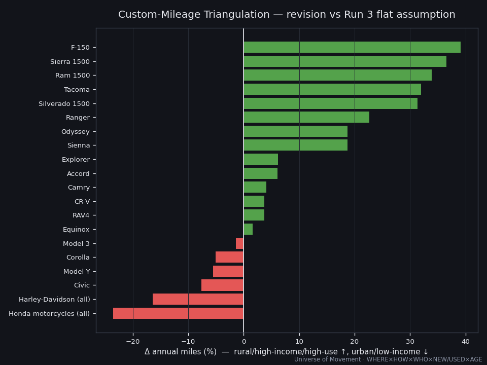
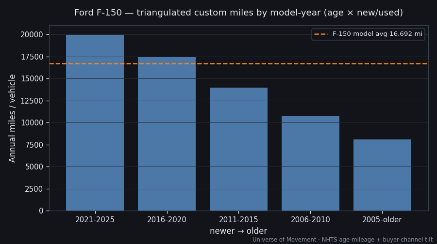

# Precision Layer — Triangulated Custom Mileage (WHERE × HOW × WHO × NEW/USED × AGE)

> Part of the [NA Consumer Auto](../REPORT.md) deep dive. Replaces Run 3's flat
> per-model annual-miles assumptions with a **multiplicative factor model** that
> triangulates a *custom* annual-mileage figure for every (type, company, make,
> model, model-year, new/used). Recompute: `python3 tools/mileage_model.py`.

## The idea

We stopped assuming a national average applies to every model. Instead we
estimate each vehicle's mileage from **who owns it, where, how, and whether it
was bought new or used**:

```
custom_miles(model) = base_by_type[type] × normalize( geo × income × driverage )
custom_miles(model, model-year) = custom_miles(model) × normalize( age_curve × new/used )
```

- **HOW (type)** sets the *level*: pickup ~13,900 · car ~12,000 · SUV ~11,800 ·
  motorcycle ~2,600 mi/yr (NHTS/iSeeCars).
- **WHERE, WHO** *redistribute* around it, **mean-normalized (VIO-weighted) to
  1.0** so they never inflate the fleet total — they only move miles between
  models. This is the key discipline: precision without double-counting distance.

### The signals (all sourced)

| Factor | Signal | Anchor |
|--------|--------|--------|
| WHERE | Geographic ownership skew × local mileage | Wyoming 21,588 vs DC 6,695 mi/driver; pickups rural/mountain, EVs/luxury urban-coastal |
| WHO — income | Owner income × (dampened) mileage elasticity | HH >$70k drive ~2× HH <$10k; F-150 = #1 vehicle for >$200k earners |
| WHO — driver age | Owner age-mix × age-mileage curve | 35–54 peak 15,291; 65+ 7,646 |
| NEW/USED | Buyer-channel income & vehicle newness | new-buyer HH ~$80k vs used ~$48k |
| AGE | Vehicle-age mileage decay | 1–5 yr >12,000; 9+ yr ~7,800 |

## What the triangulation changes

VIO-weighted fleet custom mileage lands at **11,717 mi/yr** across the top-20
models. Revisions vs the Run 3 flat assumptions:



| Direction | Models | Why |
|-----------|--------|-----|
| **Up most** | F-150 **+39%**, Sierra +37%, Ram +34%, Tacoma +32% | pickups: rural/mountain geography + high owner income + utility use + high type-base |
| Mild up | Sienna/Odyssey +19%, Accord/CR-V/RAV4 +4–6% | affluent families; mainstream commuters |
| **Down most** | Honda motos −24%, Harley −16%, Civic −8%, Model Y −6% | motorcycles seasonal/recreational; compacts urban/younger/lower-income; EVs urban-coastal (geo ↓, partly offset by income ↑) |

F-150 AHV moves **12.4 → 17.3M person-mph** once its rural, high-income, high-use
profile is priced in. Sierra jumps two ranks; Civic and Corolla fall.

## The consistency insight it surfaces

If the popular top-20 models average **11,717 mi/yr** but the *whole* US personal
fleet averages ~**10,160** (2.56T ÷ ~252M personal vehicles), then the **long tail
of 300+ models must average materially *less*** than the headline vehicles. That
is a testable, non-obvious implication: the vehicles you *see* most (new-ish
trucks/SUVs) are driven more than the fleet as a whole; the tail (older economy
cars, second/third household vehicles) drags the average down. Granularity didn't
just refine the number — it **changed the shape of the distribution** we assume.

## Deepest drill — F-150 by model-year, now with new/used



| Model-year | age × new/used | Custom miles/yr | VMT (B) |
|------------|---------------:|----------------:|--------:|
| 2021–2025 (new) | 1.32 | 20,019 | 78.1 |
| 2016–2020 | 1.15 | 17,462 | 55.9 |
| 2011–2015 | 0.92 | 13,980 | 28.0 |
| 2006–2010 | 0.71 | 10,714 | 11.8 |
| ≤2005 (old/used) | 0.53 | 8,101 | 3.2 |

A **new** F-150 is driven ~2.5× a **20-year-old** one — the new/used and
age-decay signals compound. Cohort miles reconcile (VIO-weighted) to the F-150
model average of 16,692 mi/yr by construction.

## Honest limits (read this)

1. **Ecological inference.** We know model→income and income→miles, but not
   directly model→miles. Combining marginals **assumes conditional independence**
   of the factors given the model. Where owners of a model are jointly (say)
   high-income *and* urban, our multiplication can over- or under-shoot. This is
   the central caveat — the model is a principled prior, not a measurement.
2. **Collinearity.** Income, new/used, homeownership, and geography partly measure
   the same socio-economic signal. We apply income at full weight, treat new/used
   as a small *residual* at the cohort level only, and keep geo modest — but some
   double-counting risk remains. Factor elasticities live in `factors.json` and
   can be dialled down.
3. **Hand-set profiles.** Per-model geo/income/driverage multipliers are
   analyst-set from segment evidence (🟡), not fitted to per-model telematics.
   The true fix is the L6 data (telematics/registration) named in the
   [Granularity Frontier](../GRANULARITY_FRONTIER.md).
4. **Normalization scope.** Factors are normalized within the 20-model tree, not
   the whole fleet, so the +12.3% level shift reflects the top-20's truck/SUV
   skew, not a change to the national total (which stays FHWA-fixed at 2.56T).

## What this unlocks

A reusable, transparent **triangulation engine** (`tools/mileage_model.py`) that
turns marginal demographic/geographic data into per-unit estimates for *any*
mode — the same method would price ferry-vs-cruise passenger profiles, or
regional aviation, once we census who uses what, where. The factor config is data,
not code: add a signal (e.g., household size, fuel type) by extending
`factors.json`.
