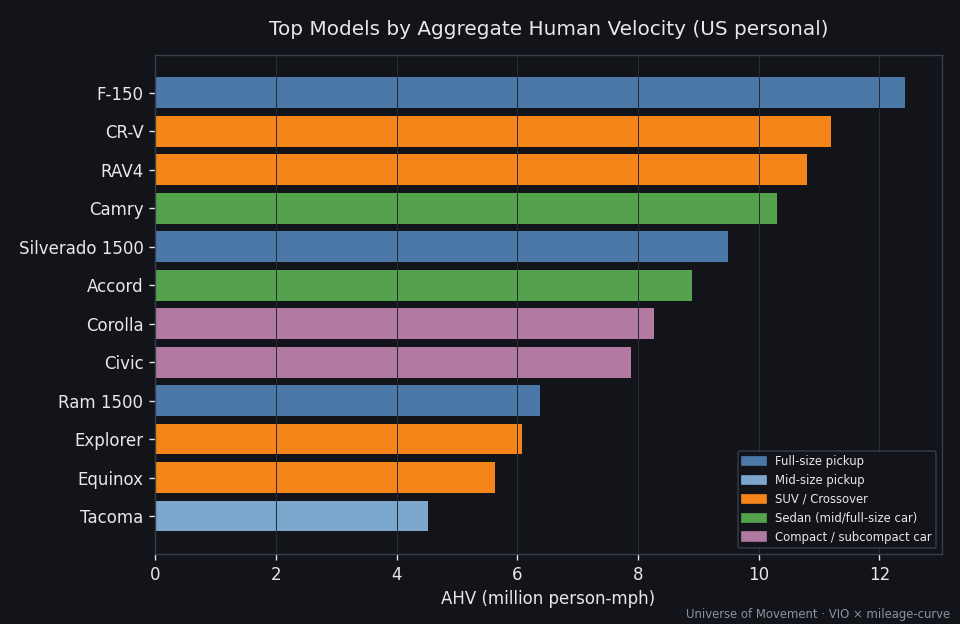
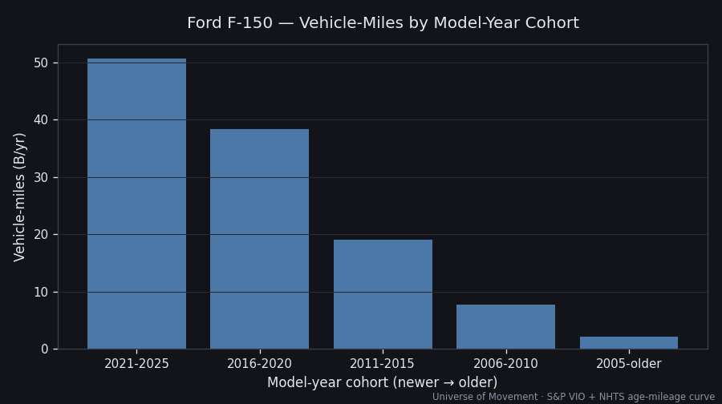

# NA Consumer Auto — Granular Decomposition (type → company → make → model → year)

> Part of the [North American Consumer Auto](../REPORT.md) deep dive.
> A depth experiment — see [The Granularity Frontier](../GRANULARITY_FRONTIER.md)
> for the capability/limits meta-analysis. Numbers here are a demonstration of
> method, not a precise census (see confidence notes).

## What this is

We decomposed US personal light-vehicle travel down the full hierarchy —
**vehicle type → parent company → make/brand → model → model-year** — to see how
deep public data lets us go. Model-level VMT is published nowhere, so we modelled
it bottom-up: **VMT = VIO × personal-share × annual-miles** (grounded in S&P DMV
VIO shares + the NHTS age-mileage curve). Recompute with
`python3 tools/granular_rollup.py`.

## Coverage & the long tail

| | |
|---|---|
| Named models in tree | **20** |
| Sum of their personal VMT | **0.70 T vehicle-miles** |
| US personal VMT (deep-dive target) | 2.56 T |
| **Coverage** | **27.3%** — the other ~73% is 300+ tail models |

The 20 most-common vehicles carry barely a quarter of the distance: granularity
has sharply diminishing returns for the *aggregate*, but is indispensable for any
*per-model* question.

## Top models by AHV contribution

| # | Model | VIO (M) | Personal VMT (B mi) | AHV (M p-mph) | Conf |
|---|-------|--------:|--------------------:|--------------:|------|
| 1 | Ford F-150 | 10.6 | 72.5 | 12.42 | 🟢 |
| 2 | Honda CR-V | 5.7 | 57.7 | 11.19 | 🟢 |
| 3 | Toyota RAV4 | 5.5 | 55.7 | 10.80 | 🟢 |
| 4 | Toyota Camry | 6.6 | 64.4 | 10.30 | 🟢 |
| 5 | Chevy Silverado 1500 | 7.7 | 55.4 | 9.49 | 🟢 |
| 6 | Honda Accord | 5.7 | 55.7 | 8.90 | 🟢 |
| 7 | Toyota Corolla | 5.5 | 51.7 | 8.26 | 🟢 |
| 8 | Honda Civic | 5.0 | 49.4 | 7.89 | 🟢 |
| 9 | Ram 1500 | 5.0 | 37.2 | 6.37 | 🟡 |
| 10 | Ford Explorer | 3.2 | 31.3 | 6.07 | 🟡 |

> **Occupancy reshuffles the ranking**: the CR-V and RAV4 (SUV occupancy 1.7)
> outrank the higher-VIO Camry and Silverado. Biggest-by-sales ≠ biggest-by-human-
> velocity.

## Rollup by company (tree slice)

| Company | AHV (M p-mph) |
|---------|--------------:|
| Toyota | 37.7 |
| Honda | 32.5 |
| Ford | 20.1 |
| GM | 19.3 |
| Stellantis | 6.4 |
| Tesla | 5.6 |

> Toyota + Honda lead consumer AHV despite GM + Ford leading US *sales* — because
> Toyota/Honda skew personal passenger vehicles while GM/Ford skew commercial
> trucks. **Caveat:** the tree is a partial slice; GM/Ford have many models not yet
> entered, so their totals here understate reality.

## Deepest drill — Ford F-150 by model-year

| Model-year | Age | VIO (M) | Annual miles | VMT (B mi) |
|------------|-----|--------:|-------------:|-----------:|
| 2021–2025 | 0–4 | 3.9 | 13,000 | 50.7 |
| 2016–2020 | 5–9 | 3.2 | 12,000 | 38.4 |
| 2011–2015 | 10–14 | 2.0 | 9,500 | 19.0 |
| 2006–2010 | 15–19 | 1.1 | 7,000 | 7.7 |
| ≤2005 | 20+ | 0.4 | 5,500 | 2.2 |
| **Fleet** | — | **10.6** | — | **118** |

- **F-150 fleet AHV ≈ 20.2M person-mph** (all F-150s) → but
- **F-150 consumer AHV ≈ 11.5M** (× 0.57 personal share) — a **43% haircut** once
  work trucks are removed. This personal/commercial split is invisible in DMV
  counts and is the dominant error source below brand level.
- One model ≈ **2.2%** of the entire North American consumer-auto AHV (515M).

Going one level deeper — **trim / powertrain / VIN** — is the frontier wall:
measurable only by DMV, OEM telemetry, or insurer telematics, never by public
research. See [The Granularity Frontier](../GRANULARITY_FRONTIER.md).

## Data Quality & Limitations
- Top-5 model VIO 🟢 (S&P DMV shares). Tail models, model-year splits, and
  personal shares are 🟡→🔴 modelled. US-only (Canada/Mexico model data too thin).
- 27.3% coverage is a *floor* and a method demo — not a full census. A paid VIO
  dataset would convert L4–L5 to 🟢.

## Sources
1. [S&P / Ford-Trucks — most common vehicles on US roads (VIO shares)](https://www.ford-trucks.com/how-tos/slideshows/top-10-most-common-vehicles-on-american-roads-999707)
2. [S&P Global Mobility — 286M VIO, avg age 12.6 yr](https://www.spglobal.com/mobility/en/research-analysis/average-age-vehicles-united-states-2024.html)
3. [GoodCarBadCar — 2024 US model sales](https://www.goodcarbadcar.net/2024-u-s-auto-sales-figures-by-model-all-vehicle-ranked/)
4. [NHTS 2017 — annual miles by vehicle age](https://nhts.ornl.gov/assets/2017BESTMILE_Documentation.pdf)
