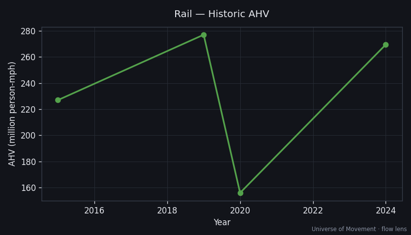

# Rail — Aggregate Human Velocity Analysis (Flow Lens)

> Part of the [Universe of Movement](../../../README.md) project. Run 1, flow lens.

## Executive Summary

Rail moved ~**3.8 trillion pkm** in 2023
([Statista/UIC](https://www.statista.com/statistics/263546/global-rail-passenger-activity-by-region/)),
~83% of it in Asia-Pacific, for an **AHV of ~270 million person-mph** (~7% of
mechanised AHV). ~**6.7 million people are aboard trains at any average instant**.
China and India alone are roughly half of world rail pkm.

## Scope

Passengers + crew of metro, commuter, intercity, and high-speed rail. Freight
crew counted separately (negligible). Reference frame: ground.

## Current State

| Metric | Value | Source | Confidence |
|--------|-------|--------|------------|
| Annual pkm (2023) | 3.8 trillion | [Statista/UIC](https://www.statista.com/statistics/263546/global-rail-passenger-activity-by-region/) | 🟡 |
| Average speed | ~40 mph (blend) | Modelled | 🔴 |
| **AHV** | **270M person-mph** | 3.8e12 × 0.621371 / 8760 | 🟡 |
| People in motion (avg) | ~6.7M | AHV ÷ 40 | 🔴 |
| Population share | 0.083% | — | 🔴 |

## Historic Trend

~3.2T (2015) → 3.9T (2019) → 2.2T (2020, −44%) → 3.8T (2024). Rail's COVID dip
sat between aviation's collapse and road's shallow dip.

## Subcategory Breakdown

| Subcategory | Share | Avg speed |
|-------------|-------|-----------|
| Commuter / regional | 33% | 30 mph |
| Metro / subway / light rail | 30% | 20 mph |
| Intercity conventional | 22% | 55 mph |
| High-speed rail | 15% | 150 mph |

> HSR is only 15% of pkm but its high speed makes it a disproportionate AHV
> contributor per traveller — a candidate for its own capsule.

## Projections (AHV, person-mph)

| Scenario | 2030 | 2050 | Key assumptions |
|----------|------|------|-----------------|
| Baseline (+3%/yr) | 330M | 596M | China/India HSR buildout continues |
| High-Mobility (+5%/yr) | 371M | 984M | Global HSR expansion (EU, US, India, Gulf) |
| Substitution (+2%/yr) | 311M | 463M | Rail benefits modestly from car substitution |

## Key Findings

1. **Rail is an Asia story**: ~83% of pkm is Asia-Pacific; China + India ≈ half.
2. **HSR punches above its share** on AHV due to speed — worth isolating.
3. **Rail is the "substitution winner"** among mechanised modes: unlike road, its
   substitution scenario still grows (mode shift from cars).

## Data Quality & Limitations
- Country coverage varies; UIC members ≠全 world. Average speed modelled (🔴).

## Sources
1. [Statista — Global rail passenger activity by region](https://www.statista.com/statistics/263546/global-rail-passenger-activity-by-region/)
2. [UIC — Traffic trends 2023](https://uic.org/com/enews/article/traffic-trends-among-uic-member-companies-in-2023)
