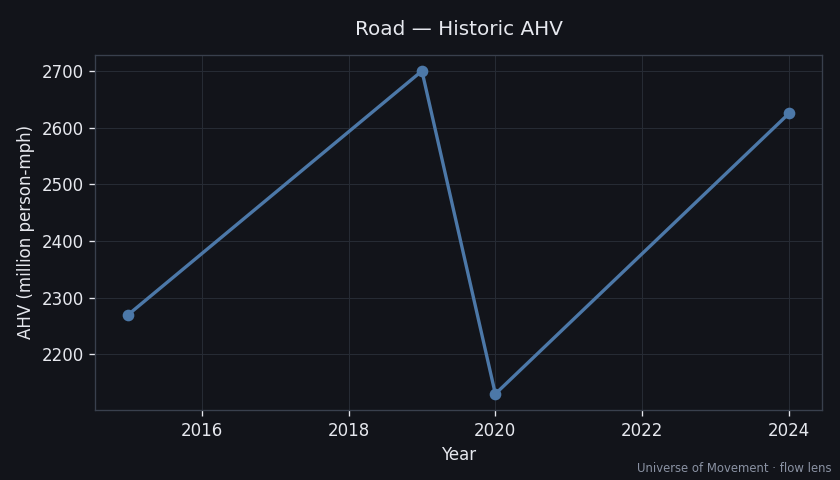

# Road — Aggregate Human Velocity Analysis (Flow Lens)

> Part of the [Universe of Movement](../../../README.md) project. Run 1, flow lens.

## Executive Summary

Road transport is **humanity's dominant mode by AHV**: ~**37 trillion pkm/yr**
yields ~**2.63 billion person-mph — roughly 68% of all mechanised AHV**. Unlike
aviation, road wins on headcount: ~**88 million people are on the roads at any
average instant** (~1.1% of humanity). This is the modal engine of the Big Number.

## Scope

Passengers + drivers of cars, two/three-wheelers, buses, taxis, and trucks
(driver only; cargo excluded). Reference frame: ground. Metric: AHV = pkm ÷ hrs/yr.

## Method note (confidence 🟡)

Global road pkm is not published as a single audited figure. We use the **ITF
global passenger-activity envelope** (44T pkm in 2015 → 122T by 2050,
[ITF 2019](https://www.itf-oecd.org/transport-demand-set-triple-sector-faces-potential-disruptions))
and take road as the **residual** after air (9.0T), rail (3.8T) and water (~0.2T):
~37T for ~2024. This is the least certain of the top-3 modes and a priority for
triangulation in Run 2 (IEA mobility + national travel surveys).

## Current State

| Metric | Value | Source | Confidence |
|--------|-------|--------|------------|
| Annual pkm (2024) | ~37 trillion | ITF residual | 🟡 |
| Average speed | ~30 mph (blended) | Modelled | 🔴 |
| **AHV** | **2.63B person-mph** | 37e12 × 0.621371 / 8760 | 🟡 |
| People in motion (avg) | ~88M | AHV ÷ 30 | 🔴 |
| Population share | ~1.1% | — | 🔴 |

## Historic Trend

~32T (2015) → 38T (2019) → dip to ~30T (2020, COVID) → ~37T (2024). Road's COVID
dip (~−20%) was shallower than aviation's (−66%): local mobility resumed faster.

## Subcategory Breakdown

| Subcategory | Share of road pkm | Avg speed |
|-------------|-------------------|-----------|
| Cars — sedans | 30% | 32 mph |
| Cars — SUVs/crossovers | 22% | 32 mph |
| Cars — pickups/light | 10% | 32 mph |
| Two/three-wheelers | 20% | 22 mph |
| Buses & coaches | 16% | 28 mph |
| Trucking (driver only) | 2% | 40 mph |

> Cars (all) ≈ 62% of road pkm. Two/three-wheelers punch above their pkm share in
> *headcount* (low speed, short trips) — a Run-2 snapshot-lens capsule.

## Projections (AHV, person-mph)

| Scenario | 2030 | 2050 | Key assumptions |
|----------|------|------|-----------------|
| Baseline (+2%/yr) | 2.96B | 4.39B | Developing-world motorisation offsets developed-world plateau |
| High-Mobility (+3.5%/yr) | 3.23B | 6.45B | Rapid India/Africa car ownership; AV-enabled trip growth |
| Substitution (−0.3%/yr) | 2.57B | 2.43B | "Peak car": remote work, 15-min cities, road pricing |

## Key Findings

1. **Road is ~2/3 of the Big Number** — the modal center of gravity.
2. **The substitution scenario is the only one where a major mode *shrinks*** —
   road is where the decoupling thesis would first show up.
3. **Residual sourcing is the weak link** — upgrading road's confidence is the
   single highest-value task for Run 2.

## Data Quality & Limitations
- pkm is a residual, not a direct measurement (🟡). Average speed is modelled (🔴).
- Two/three-wheeler activity in Asia/Africa is under-measured — likely understated.

## Sources
1. [ITF — Transport demand set to triple](https://www.itf-oecd.org/transport-demand-set-triple-sector-faces-potential-disruptions)
2. [ITF — Passenger & freight transport trends](https://www.itf-oecd.org/passenger-freight-transport-trends)
