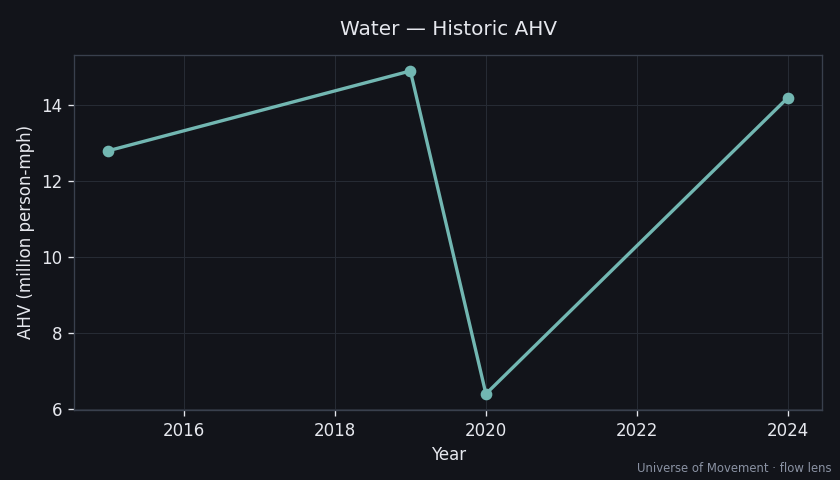

# Water — Aggregate Human Velocity Analysis (Flow Lens)

> Part of the [Universe of Movement](../../../README.md) project. Run 1, flow lens.

## Executive Summary

Water transport moves enormous *cargo* but relatively few *people-kilometres*:
~**0.2 trillion pkm/yr**, for an **AHV of ~14 million person-mph** (~0.4% of
mechanised AHV). Ferries carry the most passengers (~4.27B/yr,
[Interferry](https://interferry.com/ferry-industry-facts/)) but over short
distances; cruise carries far fewer people (34.6M in 2024,
[CLIA](https://cruising.org/sites/default/files/2025-07/State%20of%20the%20Cruise%20Industry%20Report%202025.pdf))
over longer voyages. This mode is the clearest illustration of the
**"Movement of People" vs "Movement of Stuff"** split.

## Scope

Passengers + crew of ferries, cruise ships, recreational craft, cargo ships
(crew only — ~1.89M seafarers,
[ICS](https://www.ics-shipping.org/shipping-fact/shipping-and-world-trade-global-supply-and-demand-for-seafarers/)),
naval vessels, and fishing boats. Cargo tonne-km excluded.

## Current State

| Metric | Value | Source | Confidence |
|--------|-------|--------|------------|
| Annual pkm (2024) | ~0.2 trillion | Interferry + CLIA + ICS | 🔴 |
| Average speed | ~18 mph (~15 kn) | Modelled | 🔴 |
| **AHV** | **14M person-mph** | 0.2e12 × 0.621371 / 8760 | 🔴 |
| People in motion (avg) | ~0.79M | AHV ÷ 18 | 🔴 |
| Population share | ~0.010% | — | 🔴 |

## Subcategory Breakdown

| Subcategory | Share of water pkm | Avg speed |
|-------------|--------------------|-----------|
| Ferries | 42% | 16 mph |
| Cruise | 40% | 22 mph |
| Cargo shipping (crew) | 8% | 17 mph |
| Recreational boating | 6% | 12 mph |
| Naval / military (crew) | 3% | 20 mph |
| Fishing (crew) | 1% | 10 mph |

> The **naval** subcategory (carrier / submarine / surface-combatant crews) is a
> planned dedicated capsule — headcount is well-bounded (fleet complements) even
> where positions are classified.

## Historic Trend

Cruise shut down almost entirely in 2020 (pkm ~−57% for the mode); ferries were
more resilient (essential local transport). Recovered to ~0.2T by 2024.

## Projections (AHV, person-mph)

| Scenario | 2030 | 2050 | Key assumptions |
|----------|------|------|-----------------|
| Baseline (+2%/yr) | 16M | 24M | Cruise fleet growth continues |
| High-Mobility (+3%/yr) | 17M | 31M | Cruise + fast-ferry expansion in Asia |
| Substitution (+1%/yr) | 15M | 18M | Cruise is leisure, resilient to telepresence |

## Key Findings

1. **Water is a rounding error in AHV** despite dominating global *freight*.
2. **Ferries = many people, short trips; cruise = few people, long voyages** — a
   textbook headcount-vs-distance contrast within a single mode.
3. **Cargo crew** (~1.89M seafarers) move constantly but contribute little AHV —
   the human sliver of the "Movement of Stuff" giant.

## Data Quality & Limitations
- Ferry average trip distance is assumed (~20 km); cruise pkm is voyage-modelled.
  Whole mode is 🔴 — a Run-2 triangulation target (low stakes for the Big Number).

## Sources
1. [Interferry — Ferry Industry Facts](https://interferry.com/ferry-industry-facts/)
2. [CLIA — State of the Cruise Industry 2025](https://cruising.org/sites/default/files/2025-07/State%20of%20the%20Cruise%20Industry%20Report%202025.pdf)
3. [ICS — Seafarer workforce](https://www.ics-shipping.org/shipping-fact/shipping-and-world-trade-global-supply-and-demand-for-seafarers/)
